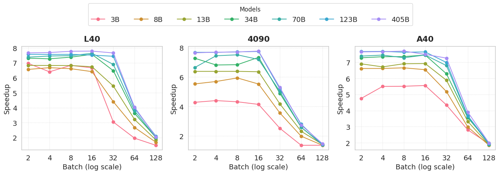

<div align="center">
  
</div>

# TriRun

TriRun is a fork of [Marlin](https://github.com/IST-DASLab/marlin), with the goal of making it work with FP16xINT2 matrix multiplications,
for inference with ternary models like TriLMs and TriTera.
It achieves close to ideal (8x) performance gains (compared to FP16xFP16 matmul) up to batchsizes of 16-32 tokens.

<!-- TODO: link to TriLMs and TriTera repos -->

## Differences and similarities with Marlin

Since this is only a slight modification of [Marlin](https://github.com/IST-DASLab/marlin), most of the optimization techniques are the same,
except that it operates on half the quantized bit width (2-bit vs 4-bit), which changes some of the performance dynamics.

Notably, while the theoretical per-element memory throughput for quantized tensors is doubled (since they are twice as small),
the overall compute budget stays the same, which makes the FP16xINT2 matrix multiplications more quickly compute-bound as the batchsizes grow.
Better results are observed on GPUs with high FLOP to byte ratios (L40, RTX 4090, etc.).

There might still be room for improvement, since we didn't go through the full effort of re-engineering the quantized reads of 8 bytes back to 16 bytes (yet).

## Techniques:

Most modern GPUs feature FLOP to byte ratios of around 100-200.
Hence, as long as we perform less than 13-25 (tensor core) multiply-accumulates per 2-bit quantized weight, it should (theoretically) be possible to maintain near ideal 8x speedup over FP16 weights.
This means that the full performance benefits of weight-only quantization should, in principle, extend to batchsizes 4-8x larger than what is currently achieved by existing kernels.
However, actually realizing this in practice is very challenging, since we essentially need to fully utilize all available GPU resources (global memory, L2 cache, shared memory, tensor cores, vector cores), *simultaneously*.
TriRun accomplishes this through numerous techniques and optimizations, briefly sketched below:

* We organize computation in such a way that all activations are essentially always fetched from L2 cache and are further reused several times within registers to make sure that repeated loading from shared memory does not become a bottleneck either.
* We execute global weight loads asynchronously, to all compute operations but also activations loads, with a cache policy that allows immediate eviction in order to not unnecessary pollute the L2 cache with values that are never reused.
* We perform shared memory loads, whose footprint is quite significant due to relatively large activations, via double buffering to overlap them with computation and global loads.
* We carefully order dequantization and tensor core instructions to ensure that both GPU pipelines are well saturated and do not bottleneck each other.
* In general, both quantized weights and group scales are reshuffled offline, into a layout that gives ideal access patterns during execution, allowing for instance directly dequantizing weights into tensor core organization.
* We have multiple warps in a threadblock compute partial results of the same output tile, in order to achieve higher warp counts, maximizing compute and latency hiding, without increasing the output tile size, which would make good partioning on realistic matrices difficult.
* Most loads use maximum vector length for peak efficiency and we also perform several layout transformations to guarantee that all shared memory reads and writes are conflict-free, in particular for matrix loading instructions, and that global reduction happens at minimal memory overhead.
* We set up and unroll loops such that the majority of memory offsets are static, minimizing runtime index calculations.
* We implement a "striped" paritioning scheme where the segment of tiles processed by each SM may (partially) span over multiple column "slices". This leads to good SM utlization on most matrix shapes, while minimizing required global reduction steps.
* Global reduction happens directly in the output buffer (temporarily downcasting FP32 accumulators to FP16) which is kept in L2 cache; reduction operations are generally optimized to avoid any unnecessary reads or writes as well.
* Overall, the kernel's PTX assembly was extensively analyzed in NSight-Compute, and the CUDA code features several more redundant or slightly suboptimal constructions that however compile to faster PTX.

## Benchmarks:

We compare the performance of TriRun layers against PyTorch FP16 (using CUTLASS) on different NVIDIA GPUs, with the `bench.py` script.



With tensor sizes of larger models, TriRun shows near-optimal speedups up to batchsizes of 16-32.

<!-- TODO: elaborate on why L40 shows better results than the other GPU models -->

## Requirements:

* CUDA >= 11.8 (in particular also for the `nvcc` compiler, the version of which should match with torch)
* NVIDIA GPU with compute capability >= 8.0 (Ampere or Ada; Marlin and TriRun are not yet optimized for Hopper)
* `torch>=2.0.0`
* `numpy`

For running quantization script one also needs:
* `transformers`
* `datasets`
* `sentencepiece`

## Usage:

If all requirements are met, it should be possible to install TriRun by calling

```
pip install .
```

in the root folder of this repository.

Afterwards, the easiest way to use the TriRun kernel is via a `trirun.Layer`, a torch-module representing a TriRun
quantized layer. It allows converting a "fake-quantized" (dequantized values stored in FP16) `torch.Linear` layer into
the compressed TriRun format via `trirun.Layer.pack(linear, scales)`. Alternatively, the kernel can also be called
directly through `trirun.mul(..)`, provided that weights and scales have already been appropriately preprocessed (see
`trirun.Layer.pack(...)`). The kernel itself can be found in the self-contained `trirun/trirun_cuda_kernel.cu` file,
which does not contain any dependencies beyond base-CUDA and should thus be easy to integrate into other lower-level
frameworks.

Correctness tests can be executed via `python test.py` and benchmarks via `python bench.py`. Please note that in order
to reproduce Marlin's "sustainable performance" benchmarks with TriRun, the GPU clocks need to be locked to their respective base values
using:

```
sudo nvidia-smi --lock-gpu-clocks=BASE_GPU_CLOCK --lock-memory-clocks=BASE_MEM_CLOCK
```

Additionally, if ECC is enabled (e.g., on an A10), then the maximum achievable memory bandwidth will be 10-15% lower
than in the official spec sheet as every memory requests will contain checksum overheads. This can be disabled via 

```
sudo nvidia-smi -e 0
```

## GPTQ Example:

In the `gptq` subfolder, we also provide a slightly improved version of the [GPTQ](https://github.com/IST-DASLab/gptq) algorithm, with better group grid clipping and non-uniform calibration sample length, that can produce TriRun-compatible 2-bit versions of Llama2 models.
Additionally, there is a script to evaluate such compressed models (using TriRun kernels) in the popular [LLM eval harness](https://github.com/EleutherAI/lm-evaluation-harness).
The script below was tested with `lm-eval-harness==0.4.0` and may not work with newer or older versions. 
Here are corresponding sample commands (`trirun`, `transformers` and `datasets` packages must be installed):

```
% Compress Llama2 model and export model in TriRun format.
python llama2.py LLAMA2_CHECKPOINT --wbits 2 --save checkpoint.pt
% Perform perplexity evaluation of uncompressed model.
python llama2.py LLAMA2_CHECKPOINT
% Evaluate compressed model (with TriRun kernels) in the eval harness.
python eval.py --model hf --model_args pretrained=LLAMA2_CHECKPOINT --tasks mmlu \
  --trirun_checkpoint checkpoint.trirun.g128
% Evaluate full precision baseline.
python eval.py --model hf --model_args pretrained=LLAMA2_CHECKPOINT --tasks mmlu 
```

<!-- TODO: maybe show some test results in a table? -->

We note that this GPTQ example is currently intended mostly as a demonstration of how to produce accurate TriRun models and as an end-to-end validation of kernel correctness (rather than to be a flexible compression tool).

## Thanks:

This work is heavily based on [Marlin](https://github.com/IST-DASLab/marlin).

<!-- TODO: add a "Cite:" section, maybe? -->
